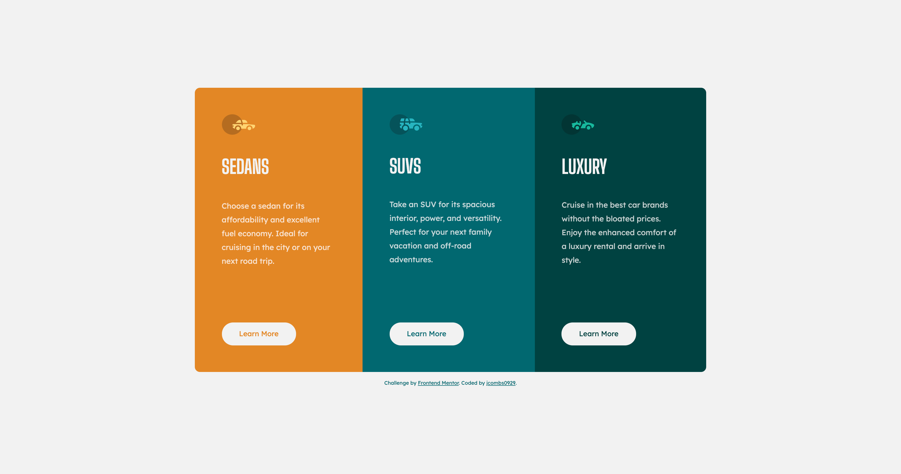

# Frontend Mentor - 3-column preview card component solution

This is a solution to the [3-column preview card component challenge on Frontend Mentor](https://www.frontendmentor.io/challenges/3column-preview-card-component-pH92eAR2-). Frontend Mentor challenges help you improve your coding skills by building realistic projects. 

## Table of contents

- [Overview](#overview)
  - [The challenge](#the-challenge)
  - [Screenshot](#screenshot)
  - [Links](#links)
  - [Built with](#built-with)
- [Author](#author)

## Overview

### The challenge

Replicate static designs using any means you choose. I used flexbox for this exercise.

### Screenshot

### Links

- Solution URL: [Solution](https://www.frontendmentor.io/solutions/3column-preview-card-flexbox-mobile-first-IdAYygqTH)
- Live Site URL: [Live Site](https://distracted-visvesvaraya-f8929b.netlify.app/)

### Built with

- Semantic HTML5 markup
- SCSS
- Flexbox
- Mobile-first workflow

## Author

- Frontend Mentor - [@jcombs0929](https://www.frontendmentor.io/profile/jcombs0929)

